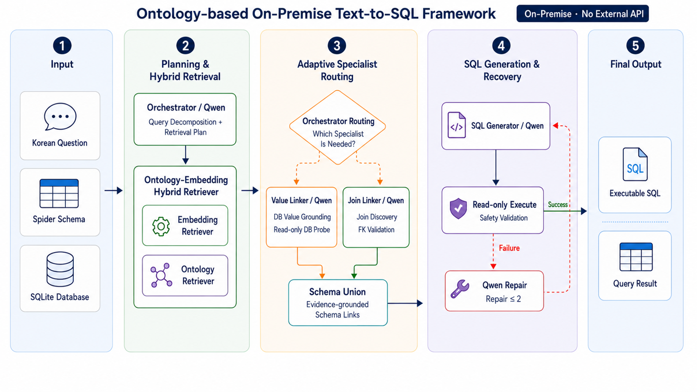

<div align="center">

# 🧠 Ontology-Augmented Multi-Agent Text-to-SQL

### An On-Premise Korean Text-to-SQL Framework with Ontology-Embedding Hybrid Retrieval

<p>
  
  
  
  
</p>

**DILAB, University of Seoul**

</div>

---

## 🔍 Overview

**Ontology-Augmented Multi-Agent Text-to-SQL** is an on-premise Text-to-SQL
framework designed for Korean natural-language queries.

The framework addresses two practical challenges in enterprise Text-to-SQL:

**Cross-lingual schema linking**  
Korean user expressions may differ substantially from English table and column
names used in enterprise databases.

**Privacy-aware deployment**  
Database schemas and values can contain sensitive organizational information,
making external API-based LLM deployment difficult.

To address these problems, we combine:

> **Ontology-based lexical grounding**  
> + **Embedding-based semantic retrieval**  
> + **Specialized SLM agents**  
> + **Database-grounded validation**

---

## 🏗️ Framework

<p align="center">
  
</p>

The system consists of five stages:

### 1. Input

The system receives:

- Korean natural-language question
- Database schema
- PK/FK metadata
- SQLite database

---

### 2. Planning & Hybrid Schema Retrieval

#### Orchestrator Agent

The Orchestrator analyzes the semantic structure of the question before
directly linking it to database schemas.

It identifies information such as:

- output targets
- filtering conditions
- aggregation
- grouping
- ordering
- table relationships

#### Ontology–Embedding Hybrid Retriever

We combine two complementary retrieval mechanisms.

**Ontology Retriever**

Matches user expressions against:

- schema names
- Korean synonyms
- domain terminology
- organization-specific expressions

using exact and fuzzy matching.

**Embedding Retriever**

Retrieves semantically related schema elements that cannot be captured by
lexical ontology matching.

The ontology provides high-precision schema candidates, while embedding
retrieval complements missing candidates to improve recall.

---

### 3. Adaptive Specialist Routing

The Orchestrator selectively invokes specialist agents depending on the
requirements of the query.

#### 🔎 Value Linker

Identifies which database column contains a value mentioned in the user query
by directly inspecting database values.

#### 🔗 Join Linker

Determines and validates JOIN paths using table relationships and PK/FK
metadata.

#### Schema Union

Evidence collected from:

- Hybrid Retriever
- Steiner FK Expansion
- Value Linker
- Join Linker

is merged into the final schema context.

---

### 4. SQL Generation & Recovery

#### SQL Generator

Generates executable SQLite SQL using:

- user question
- logical query plan
- retrieved schema
- filter evidence
- JOIN relationships

#### SQL Repair Agent

If SQL execution fails, the repair agent analyzes:

- generated SQL
- database error message

and produces a corrected SQL query.

---

### 5. Final Output

The system returns:

- Executable SQL
- Query result

---

## 🧩 Ontology-based Schema Grounding

Instead of using a general-purpose knowledge graph, our ontology is
**schema-anchored**.

Each database element is directly mapped to an ontology element:

```text
Database Table  ↔  Ontology Class
Database Column ↔  Ontology Property
Database Value  ↔  Value / Entity


## Acknowledgement

This repository was developed with support from the 서울시립대학교 데이터 사이언스 플러스 차세대 융합인재 양성사업단 - http://dsplus.uos.ac.kr/
