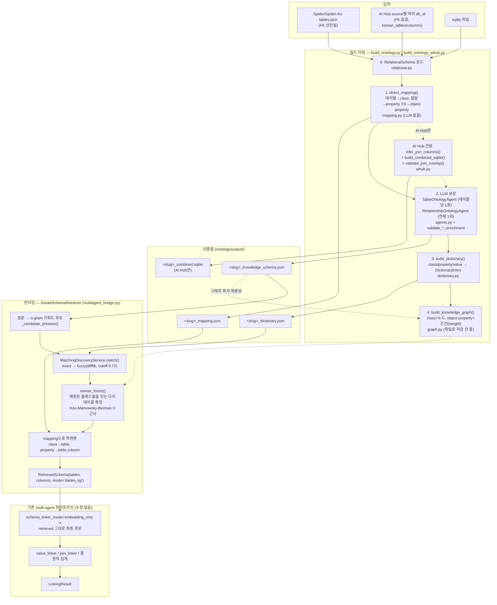

# 지식그래프 구축 과정과 실제 산출물

이 문서는 "논문 개념이 코드 어디에 대응하는가"([architecture.md](./architecture.md))가 아니라, **실제로 어떤 순서로 명령을 실행했고, 각 단계에서 어떤 파일/JSON이 나왔는지**를 다룹니다.

## 지금까지 구축한 KG 목록

| db_id / source | 원본 데이터 | 빌드 방식 | synonym 포함 | 저장 위치 |
|---|---|---|---|---|
| `dog_kennels` | Spider `tables.json` | `build_ontology.py` | 포함 | `output/` |
| `서울인구관` | AI Hub NL2SQL (source 단위 병합) | `build_ontology_aihub.py` | 포함 | `output/` |
| **Spider-Ko 160개 db_id** | Spider-Ko `train.csv`+`validation.csv`가 참조하는 db_id 전부(train 140 + validation 20, 서로 겹치지 않음) | `build_ontology_spider_ko_all.py` | **제외**(`value_synonyms`만 유지) | `output/spider_ko/` |
| **Spider 1.0 나머지 6개 db_id** (`scholar`/`imdb`/`geo`/`yelp`/`restaurants`/`academic`) | `train_tables.json`에는 있지만 Spider-Ko 질문(question_ko)에는 전혀 쓰이지 않는 db_id | `build_ontology.py --no-synonyms` (db_id별 개별 실행) | **제외** | `output/spider_ko/` (같은 폴더에 합류) |

네 그룹이 서로 다른 이유로 다른 처리 경로를 거칩니다: `dog_kennels`는 FK가 이미 선언돼 있는 표준 Spider DB, `서울인구관`은 같은 발행기관 산하에 흩어진 FK 없는 단일 테이블 여러 개를 하나로 합쳐야 하는 AI Hub 케이스([report.md](./report.md)), Spider-Ko 160개는 처음엔 validation 100문항 검증용으로 `concert_singer`/`pets_1`/`car_1` 3개만 synonym 없이 빌드했다가([spider-ko-no-synonym.md](./spider-ko-no-synonym.md)) 이후 전체 데이터셋으로 확장한 것이며, 나머지 6개는 Spider 1.0 원본에는 포함되지만 Spider-Ko 번역 질문셋에는 등장하지 않아 `build_ontology_spider_ko_all.py`의 160개 범위 판정에서 자동 제외됐던 것을 이후 사용자 요청으로 마저 채운 것입니다. `output/spider_ko/`는 결과적으로 Spider 1.0 train+dev 전체 166개 db_id를 모두 담고 있습니다.

### Spider-Ko 전체 빌드: 실행 결과

```bash
cd ontology
python3 build_ontology_spider_ko_all.py   # --db-ids/--limit/--force로 부분 재실행 가능, 이미 만든 db_id는 자동 스킵
```

`Qwen/Qwen3-4B-Instruct-2507`(전용 vLLM 인스턴스, GPU1/port 8003)로 160개 db_id 전부를 순차 처리했고, 결과는 `output/spider_ko/_build_summary.json`에 기록됩니다.

| 항목 | 값 |
|---|---:|
| 총 db_id | 160 |
| 성공(신규 빌드) | 155 |
| 스킵(이미 존재해서 재사용) | 5 (`concert_singer`, `pets_1`, `car_1`, `battle_death`, `course_teach`) |
| 실패 | 0 |
| 총 소요시간 | 6526.7초 (≈ 108.8분) |
| class 총합 | 818 |
| property 총합 | 4,291 |
| 출력 크기 | 6.7MB |

**라벨 품질 전수 조사 결과** — `--no-synonyms` 빌드에서 이미 발견했던 영어 라벨 문제([spider-ko-no-synonym.md](./spider-ko-no-synonym.md) 참고)가 전체 데이터셋 규모에서 다시 나타났습니다:

| | 영어(비한국어) primary_label 개수 | 비율 |
|---|---:|---:|
| class | 211 / 818 | 25.8% |
| property | 1,283 / 4,291 | 29.9% |
| 영향받은 db_id | 100 / 160 | 62.5% |

`car_1`(`car_makers`, `car_names`, `cars_data`), `college_1`(`COURSE`, `ENROLL`, `PROFESSOR`), `baseball_1`(엔티티 10개), `chinook_1`(`Invoice`, `InvoiceLine`, `MediaType`) 등 db_id의 절반 이상에서 최소 한 개 이상의 class가 영어 라벨로 남았습니다. 원인과 시도했던 대응(재시도 로직 → 빈 응답 유발로 롤백)은 [spider-ko-no-synonym.md](./spider-ko-no-synonym.md)에 이미 정리돼 있으며, 이번 전체 빌드로 그 문제가 3개 db_id만의 우연이 아니라 `--no-synonyms` 모드 자체의 구조적 트레이드오프임이 확인됐습니다. 사용자가 계획한 synonym 수동 채움 작업 시 이 영어로 남은 `primary_label`들도 함께 한국어로 교정하는 것이 필요합니다 — `output/spider_ko/<db_id>_knowledge_schema.json`에서 한글이 없는 `primary_label`을 찾으면 됩니다.

### 나머지 6개 db_id (`scholar`/`imdb`/`geo`/`yelp`/`restaurants`/`academic`)

같은 `Qwen/Qwen3-4B-Instruct-2507` 인스턴스로 db_id당 개별 실행(`build_ontology.py --no-synonyms --output-dir output/spider_ko`), 총 58개 테이블, 실패 0건. 라벨 품질도 같은 경향입니다:

| db_id | 영어 라벨 class |
|---|---|
| scholar | `venue`, `keyphrase`, `paper`, `paperDataset` |
| imdb | `actor`, `director`, `producer`, `directed_by`, `tv_series`, `written_by` |
| geo | 없음 |
| yelp | `tip` |
| restaurants | `LOCATION` |
| academic | `domain_conference`, `domain_publication` |

class 14/58(24.1%), property 67/212(31.6%)가 영어로 남아 — 위 160개에서 관측한 비율(25.8%/29.9%)과 거의 동일합니다.

## 파이프라인 6단계와 각 단계의 실제 산출물

### 0단계 — 입력 로드

`RelationalSchema`([relational.py](../danke_kg/relational.py))가 Spider형 `tables.json`(또는 AI Hub `source`로 묶인 여러 db_id) + 실제 sqlite 파일을 읽어 테이블/컬럼/PK/FK와, 있다면 `korean_tables`/`korean_columns`(현지어 표시명)를 채웁니다. 이 단계는 순수 파싱이라 LLM 호출이 없습니다.

### 1단계 — 직접 매핑 (`direct_mapping`, 결정론적, LLM 없음)

[`mapping.py:66`](../danke_kg/mapping.py#L66)의 `direct_mapping(schema, inferred_fk_pairs=None)`이 테이블→클래스, 컬럼→datatype property, FK→object property로 그대로 옮기는 **뼈대(skeleton)** `KnowledgeSchema`와 `RDBMapping`을 만듭니다. `korean_tables`/`korean_columns`가 있으면 `primary_label`을 미리 그 값으로 채워 넣어(LLM이 나중에 바꾸지 않는 한) 최종 결과가 원본 현지어 이름에서 크게 벗어나지 않게 하는 씨앗 역할을 합니다.

이 시점의 뼈대는 `synonyms: []`, `ranking`은 테이블/컬럼 개수 기반 임시값, `indexed`/`value_synonyms`는 전부 비어 있는 상태 — 다음 단계가 채웁니다.

### 2단계 — LLM 보강 (`TableOntologyAgent`, `RelationshipOntologyAgent`)

[`orchestrator.py`](../danke_kg/orchestrator.py)의 `OntologyBuilder.build()`가 테이블당 1회 `TableOntologyAgent.enrich_table()`을, 전체 관계에 대해 1회 `RelationshipOntologyAgent.enrich_relationships()`를 호출합니다(vLLM Qwen3-4B-Instruct, `localhost:8000`). 두 에이전트 모두 `validate_table_enrichment`/`validate_relationship_enrichment`로 **LLM 출력을 실제 스키마 요소와 대조해 존재하지 않는 컬럼/관계는 버립니다** — LLM이 지어낸 필드가 최종 KG에 섞이지 않도록 하는 안전장치입니다.

**정상 케이스** (`pets_1`, synonym 제외 빌드, `Student` 테이블 — [output/spider_ko/pets_1_knowledge_schema.json](../output/spider_ko/pets_1_knowledge_schema.json)):
```json
{
  "name": "Student", "primary_label": "학생", "synonyms": [], "ranking": 3.5
}
```
```json
{
  "name": "Student_LName", "domain": "Student", "primary_label": "성",
  "indexed": true,
  "value_synonyms": { "김": ["김", "박", "이"] }
}
```
synonym은 요청대로 비어 있지만(`--no-synonyms`), `value_synonyms`(성씨 예시 값 매핑)는 지시대로 그대로 유지됐습니다.

**문제가 된 케이스** (`concert_singer`, synonym 제외 빌드, `singer` 테이블 — [output/spider_ko/concert_singer_knowledge_schema.json](../output/spider_ko/concert_singer_knowledge_schema.json)):
```json
{ "name": "singer", "primary_label": "singer", "synonyms": [] }
```
```json
{ "name": "singer_Name", "domain": "singer", "primary_label": "name", "indexed": true }
{ "name": "singer_Country", "domain": "singer", "primary_label": "country", "indexed": true }
{ "name": "singer_Age", "domain": "singer", "primary_label": "age", "indexed": false }
```
`primary_label`이 전부 영어로 남았습니다 — synonym 필드가 있을 때는 "원어(영어)는 synonym에, primary_label은 한국어로"라는 지시가 언어를 자연히 분리해줬는데, synonym을 빼면서 이 분리가 깨진 사례입니다. 원인 분석과 시도했던 대응(재시도 로직 도입 → 빈 응답 유발로 롤백)은 [spider-ko-no-synonym.md](./spider-ko-no-synonym.md)에 정리돼 있습니다.

### 3단계 — 사전 구축 (`build_dictionary`)

[`dictionary.py:99`](../danke_kg/dictionary.py#L99)가 2단계에서 완성된 `KnowledgeSchema`를 훑어 `DictionaryEntry(entry_type, key, target_class, target_property, value)` 행들을 만듭니다. 실제 산출물 비교:

```
pets_1 (synonym 유지 X이지만 라벨이 전부 한국어)  →  31개 엔트리, 전부 한국어 키
  {"entry_type":"class","key":"학생","target_class":"Student"}
  {"entry_type":"class","key":"애완동물","target_class":"Pets"}
  {"entry_type":"property","key":"이름","target_class":"Student","target_property":"Student_Fname"}

concert_singer (synonym 유지 X + singer 테이블 라벨이 영어)  →  65개 엔트리
  {"entry_type":"class","key":"스테이디움","target_class":"stadium"}   ← 한국어
  {"entry_type":"class","key":"singer","target_class":"singer"}        ← 영어만, 다른 키 없음
  {"entry_type":"property","key":"name","target_class":"singer","target_property":"singer_Name"}  ← 영어만
```
`singer` 클래스로 이어지는 사전 키가 문자 그대로 `"singer"`/`"name"`/`"country"`/`"age"` 하나씩뿐이라, 한국어 질문("가수", "이름", "국가", "나이")이 exact 매칭은 물론 fuzzy 매칭(`difflib`, cutoff 0.72)으로도 절대 이 클래스에 도달하지 못합니다 — 100문항 실험에서 `singer` 테이블이 recall 0.0으로 여러 번 빠진 것과 정확히 같은 원인입니다([multiagent-integration.md](./multiagent-integration.md)의 "API 변경 대응" 절, [spider-ko-no-synonym.md](./spider-ko-no-synonym.md)의 실패 사례 참고).

### 4단계 — 지식그래프 구축 (`build_knowledge_graph`) — 파일로 저장되지 않고 즉석 재생성

[`graph.py:36`](../danke_kg/graph.py#L36)이 `KnowledgeSchema`의 클래스를 노드로, object property를 간선(가중치=`weight`)으로 하는 `KnowledgeGraph`를 만듭니다. 이 그래프 자체는 별도 파일로 저장하지 않습니다 — `<db_id>_knowledge_schema.json`만 있으면 로드할 때마다 몇 밀리초 안에 재생성할 수 있을 만큼 가볍기 때문입니다(런타임에는 `DankeSchemaRetriever.__init__`이 매번 다시 만듦).

### 5단계 — 저장

`OntologyBuilder.build()`의 결과가 세 파일로 저장됩니다(AI Hub는 네 번째 파일이 추가):

| 파일 | 내용 |
|---|---|
| `<slug>_knowledge_schema.json` | 2단계 결과 — classes/datatype_properties/object_properties 전체 |
| `<slug>_mapping.json` | 1단계에서 만든 `RDBMapping` — class→table, property→(table,column), object_property→(FK 컬럼 쌍) |
| `<slug>_dictionary.json` | 3단계 결과 — 매칭용 사전 엔트리 전체 |
| (`<slug>_combined.sqlite`, AI Hub만) | 여러 db_id의 sqlite를 `ATTACH DATABASE`로 물리 병합한 실행 가능 DB |

### (AI Hub 전용 추가 단계) 조인 추론 + 실데이터 검증

Spider(-Ko)는 FK가 이미 선언돼 있어 1단계에서 바로 object property가 나오지만, AI Hub는 거의 항상 FK가 없습니다. `aihub.py`가 이를 메우는 별도 단계를 추가로 거칩니다:
1. `infer_join_columns` — `_CD`/`_CODE`/`_ID`/`_NO`/`_KEY`로 끝나는 컬럼이 2개 이상 테이블에 공통으로 있으면 조인 후보로 추정.
2. `build_combined_sqlite` — 후보를 확정하기 전에 먼저 여러 db_id의 sqlite를 물리적으로 하나로 합침.
3. `validate_join_overlap` — 합쳐진 DB에서 후보 컬럼들의 실제 값이 몇 % 겹치는지(`min_overlap=0.05`) 확인해, 이름만 같고 실제로는 다른 코드 체계인 거짓 후보를 걸러냄.

실제로 `서울인구관`에서 `ADMDONG_CD`(행정동 코드) 컬럼이 여러 테이블에 존재했지만 7자리/5자리/2자리 등 서로 다른 코드 체계였던 조합은 여기서 걸러졌고, 최종적으로 **값이 실제로 겹치는 9개 조인만** `inferred: true, weight: 1.5`인 object property로 채택됐습니다:
```json
{
  "name": "seoulpopulation_publicadministration_21__POP_021_seoulpopulation_publicadministration_25__POP_025_fk0",
  "domain": "seoulpopulation_publicadministration_21__POP_021",
  "range": "seoulpopulation_publicadministration_25__POP_025",
  "source_fk": ["...ADMDONG_CD", "...ADMDONG_CD"],
  "weight": 1.5,
  "inferred": true
}
```
가중치 1.5는 선언된 FK(1.0)보다 오히려 높게 줘서, Steiner tree가 경로를 고를 때 "실데이터로 검증된 추론 조인"을 "선언된 FK"만큼(또는 그 이상) 신뢰하도록 한 설계입니다([relationship 보강 프롬프트](../danke_kg/agents.py)에도 "추론된 관계에 선언된 FK보다 낮은 가중치를 주지 말라"는 규칙이 명시돼 있습니다).

## 파이프라인 시각화

아래는 위 6단계 + AI Hub 전용 단계, 그리고 빌드된 KG가 런타임에 multi-agent 파이프라인과 어떻게 맞물리는지까지 포함한 다이어그램입니다.



인터랙티브(마우스오버 없이도 확대/축소 가능)로 보려면: 별도 아티팩트로도 렌더링해두었습니다.

## 참고: 어느 문서에 무엇이 있는가

- 이 문서(kg-construction-process.md): 실행 순서 + 실제 산출물 예시 + 파이프라인 다이어그램.
- [architecture.md](./architecture.md): DANKE 논문 각 절 ↔ 코드 모듈 매핑표.
- [report.md](./report.md): AI Hub `서울인구관` 빌드 중 발견한 이슈(조인 오탐 등)의 상세 보고.
- [spider-ko-no-synonym.md](./spider-ko-no-synonym.md): synonym 제외 빌드 결정 배경 + 100문항 성능 평가 결과.
- [multiagent-integration.md](./multiagent-integration.md): `DankeSchemaRetriever`가 기존 multi-agent 파이프라인과 정확히 어느 지점에서 어떤 Input/Output으로 연결되는지의 상세.
